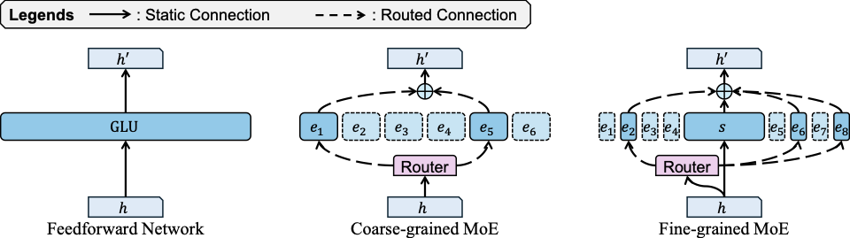
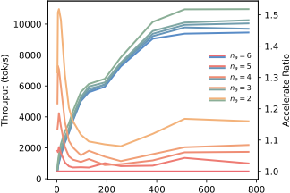

## Abstract

In fine-grained sparse Mixture-of-Experts (MoE) models, a large pool of specialized experts replaces a small homogeneous set, shifting performance and throughput to be governed by inference-time expert activation. Yet most existing optimization recipes implicitly assume a fixed activation budget, for example a constant Top-$k$ per layer, whose behavior in fine-grained MoEs is poorly understood. We first provide a systematic characterization of runtime skipping strategies, quantifying the accuracy-efficiency trade-off of (i) uniform fixed activation and (ii) static layer-wise Top-$k$ allocation found by search. Our analysis reveals that optimal static schedules vary significantly across models and routing mechanisms, lacking universality. To overcome this limitation, we introduce Adaptive Skipping with Entropy-Penalized Thresholding (ASET), a training-free policy that uses router confidence and entropy to adapt the activation count at the token level. Across representative fine-grained MoEs, our evaluated skipping strategies yield 10-78% throughput gains with minimal performance degradation, including $\geq$10% improvement on DeepSeek-V3 without measurable loss, while ASET further improves the Pareto frontier on OLMoE over strong static baselines. These results highlight expert activation as a principled lever for efficient fine-grained MoE deployment.
