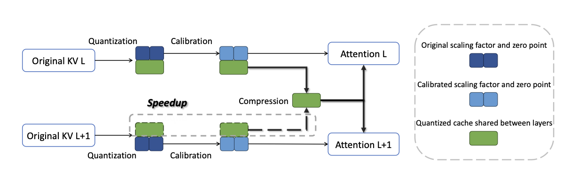

## Abstract

Large language models require substantial memory during generation because KV cache grows with context length. XQuant is a training-free, plug-and-play framework for KV cache quantization that combines (1) a computationally light data-free calibration method and (2) cross-layer KV cache compression. The method reaches sub-1.4-bit equivalent quantization and reports stronger trade-offs than prior methods such as KIVI-2bit and AsymKV-1.5bit on TruthfulQA and LongBench.
